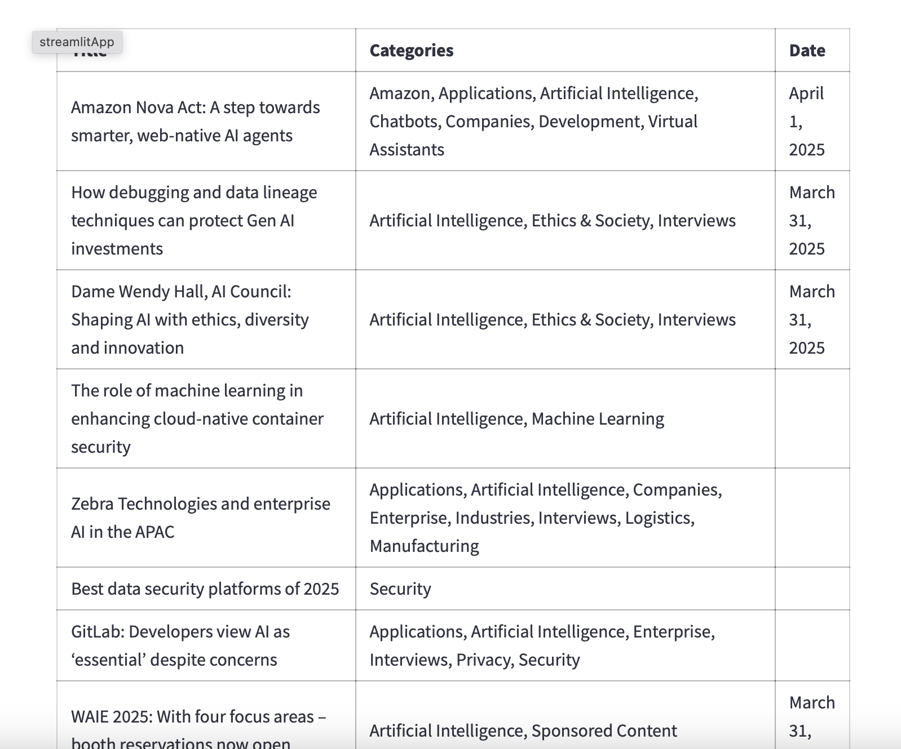
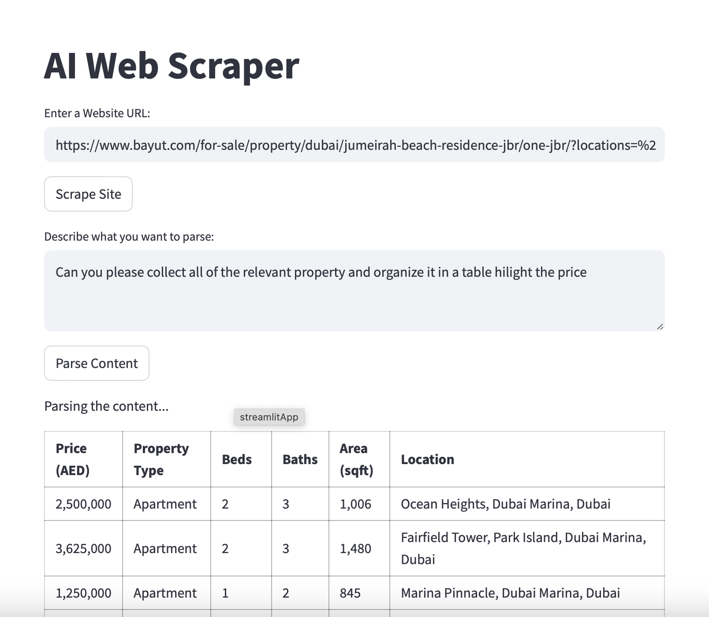

# AI Web Scraper

A Python-based web scraper that uses **Selenium** and **BeautifulSoup** to scrape web pages for content and stores the data in **AWS DynamoDB**. The scraper allows you to extract useful content from websites and process it via an API endpoint.

## Features

- **Web Scraping with Selenium & BeautifulSoup**: Scrapes content from websites.
- **Content Storage in DynamoDB**: Stores the extracted data in AWS DynamoDB for easy retrieval.
- **API Integration**: Fetches articles from a FastAPI endpoint if already scraped.
- **Headless Browser**: Supports running without a GUI for automated scraping using Chrome in headless mode.
- **Content Cleaning**: Cleans the extracted HTML to remove unnecessary tags such as `<script>` and `<style>`.

## Requirements

Before you begin, ensure you have the following:

- Python 3.x
- `pip` for installing Python packages

## Example

Enter a Website URL: https://www.artificialintelligence-news.com
Describe what you want to parse: give me the relevant AI news and organize it in a table



## Other Example




### Python Packages
You can install the required Python packages by running:

```bash
pip install -r requirements.txt

